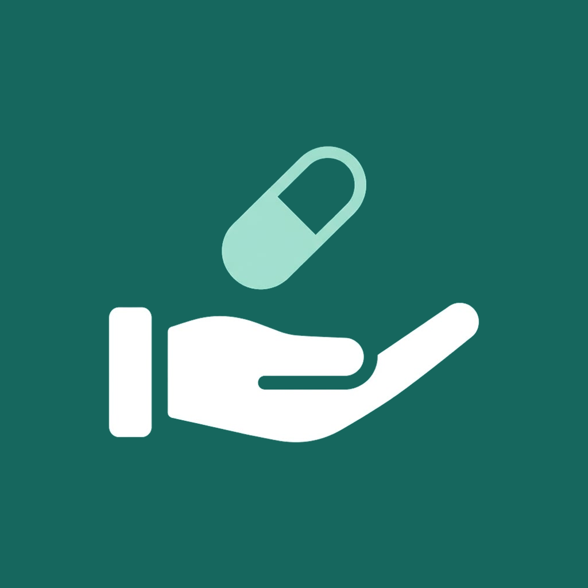

# Minha Medicação

Um aplicativo simples para não esquecer os remédios.

Ele mostra o que você precisa tomar, em que horário e quanto. Avisa na hora
certa, mesmo com o celular bloqueado. E quando você confirma que tomou, fica
registrado — acabou aquela dúvida de "será que eu já tomei hoje?".

Foi feito para uso pessoal, sem cadastro e sem cobrança. Tudo o que você
cadastrar fica guardado apenas no seu celular.

## O que ele faz

- Mostra a agenda do dia: o que tomar, a que horas e quanto.
- Avisa no horário, com a tela bloqueada, e deixa confirmar direto pelo aviso.
- Marca o que já foi tomado, para não repetir a dose por esquecimento.
- Acompanha quantos comprimidos ainda restam e avisa quando estão acabando.
- Guarda o histórico das doses tomadas e das não tomadas.
- Serve para remédio de uso contínuo e para tratamento com data para acabar.
- Aceita horários fixos (08:00 e 20:00) ou intervalos (a cada 8 horas).
- Repete todos os dias, em dias alternados, em dias da semana escolhidos
  ou uma vez por mês — para remédio semanal, injeção mensal e afins.
- Guarda foto do medicamento e da receita, se você quiser.
- Deixa apagar um cadastro feito errado, e esconder da lista o que já
  terminou — sem perder o histórico.

## Baixar e instalar

1. Abra **[a página de downloads](../../releases/latest)** pelo celular e baixe
   o arquivo que termina em `.apk`.
2. Toque no arquivo baixado.
3. O celular vai perguntar se você autoriza instalar aplicativos dessa origem.
   Pode permitir: esse aviso aparece porque o aplicativo não veio da Play Store.
4. Confirme a instalação e abra o aplicativo.
5. Na primeira abertura ele pede permissão para enviar avisos. **Permita** — é
   assim que os lembretes funcionam.

Funciona em celulares com Android 7 ou mais novo. Não funciona em iPhone.

## Perguntas comuns

**Meus dados vão para algum lugar?**
Não. Não existe conta, login nem servidor. O que você cadastra fica no seu
celular e ninguém mais tem acesso — nem quem fez o aplicativo.

**Preciso de internet?**
Não. Ele funciona normalmente no modo avião.

**Tem anúncio ou cobrança?**
Não, nenhum dos dois.

**Não recebi o lembrete no horário. E agora?**
Quase sempre é a economia de bateria do Android segurando o aviso. Vá em
*Configurações do celular → Aplicativos → Minha Medicação → Bateria* e escolha
a opção **sem restrição**. Dentro do aplicativo, em *Configurações →
Lembretes*, dá para conferir se está tudo liberado.

**Vou trocar de celular. Perco tudo?**
Não, se você fizer uma cópia antes. Em *Configurações → Backup → Criar backup*,
o aplicativo gera um arquivo que você pode salvar no Google Drive ou mandar
para si mesmo. No celular novo, instale o aplicativo e use *Restaurar backup*.

**Como atualizo para uma versão nova?**
Baixe o arquivo novo e instale por cima, sem desinstalar o aplicativo atual.
Seus dados são preservados. Desinstalar apaga tudo, então faça uma cópia antes
se precisar desinstalar.

**Posso usar para mais de uma pessoa?**
Ele foi pensado para uma pessoa por celular. Dá para cadastrar quantos
medicamentos quiser, mas não existe separação por perfil.

## Importante

Este aplicativo **organiza**, não orienta. Ele não indica medicamento, não
sugere dose e não diz o que fazer quando uma dose é esquecida. Ele apenas
lembra e registra o que você cadastrou, seguindo a receita do seu médico.

Em caso de dúvida sobre um remédio ou sobre uma dose perdida, fale com o
profissional de saúde que acompanha o tratamento.

## Para quem programa

O código é Flutter com banco local em SQLite. A documentação técnica —
arquitetura, como rodar, testes, geração do APK e assinatura — está em
[DESENVOLVIMENTO.md](DESENVOLVIMENTO.md).
